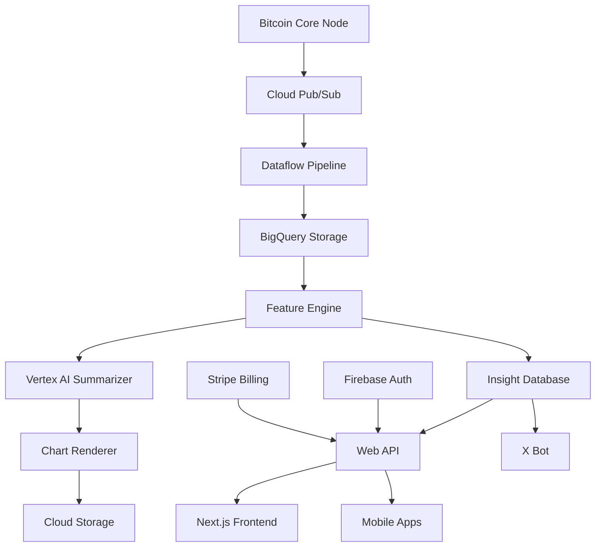

# Design Document

## Overview

The utxoIQ platform is designed as a cloud-native, event-driven system that processes Bitcoin blockchain data in real-time to generate AI-powered insights. The architecture follows a microservices pattern with clear separation between data ingestion, processing, AI inference, and presentation layers.

The system processes approximately 144 blocks per day (10-minute average) with sub-60-second latency from block mining to insight publication. It serves multiple user interfaces including a web dashboard, API endpoints, and automated social media posting.

## Architecture

### High-Level Architecture



### Data Flow Architecture

1. **Ingestion Layer**: Bitcoin Core node streams block/transaction data to Cloud Pub/Sub
2. **Processing Layer**: Dataflow normalizes and enriches data, storing in BigQuery
3. **Intelligence Layer**: Feature Engine computes signals, Vertex AI generates insights
4. **Presentation Layer**: Web API serves insights to frontend and external consumers
5. **Distribution Layer**: X Bot and notification services distribute insights

## Components and Interfaces

### 1. Data Ingestion Service

**Technology**: Cloud Pub/Sub + Dataflow
**Responsibility**: Real-time blockchain data ingestion and normalization

**Key Interfaces**:
- Bitcoin Core RPC connection for block/transaction streaming
- Pub/Sub topics: `btc.blocks`, `btc.transactions`, `btc.mempool`
- BigQuery datasets: `btc.blocks`, `btc.transactions`, `btc.entities`

**Processing Logic**:
- Parse raw Bitcoin data into structured format
- Entity resolution for known addresses (exchanges, miners)
- Data validation and anomaly detection
- 6-block confirmation policy for major signals

### 2. Feature Engine Service

**Technology**: Cloud Run (Python/FastAPI)
**Responsibility**: Signal computation and insight triggering

**Key Interfaces**:
```python
class SignalProcessor:
    def compute_mempool_signals(self, block_data: BlockData) -> List[Signal]
    def detect_exchange_flows(self, tx_data: List[Transaction]) -> List[Signal]
    def analyze_miner_treasury(self, entity_data: EntityData) -> List[Signal]
    def track_whale_accumulation(self, address_data: AddressData) -> List[Signal]
```

**Signal Types**:
- Mempool Nowcast: Fee quantiles and inclusion estimates
- Exchange Inflow Spike: Anomaly detection on tagged entities
- Miner Treasury Delta: Daily balance changes per mining entity
- Whale Accumulation: 7-day rolling accumulation patterns

### 3. AI Insight Generator

**Technology**: Vertex AI (Gemini Pro)
**Responsibility**: Convert signals into human-readable insights

**Key Interfaces**:
```python
class InsightGenerator:
    def generate_insight(self, signal: Signal) -> Insight
    def calculate_confidence(self, signal: Signal, context: Context) -> float
    def generate_headline(self, insight: Insight) -> str
    def create_evidence_citations(self, signal: Signal) -> List[Citation]
```

**Prompt Engineering**:
- Context-aware prompts with blockchain domain knowledge
- Confidence scoring based on signal strength and historical accuracy
- Evidence citation requirements for transparency
- Tone guidelines for different user personas

### 4. Chart Generation Service

**Technology**: Cloud Run (Python/Matplotlib)
**Responsibility**: Generate visual representations of insights

**Key Interfaces**:
```python
class ChartRenderer:
    def render_mempool_chart(self, data: MempoolData) -> bytes
    def render_flow_chart(self, data: FlowData) -> bytes
    def render_accumulation_chart(self, data: AccumulationData) -> bytes
    def upload_to_storage(self, chart: bytes) -> str  # Returns GCS URL
```

### 5. Web API Service

**Technology**: FastAPI + Cloud Run + OpenAPI v3
**Responsibility**: RESTful API for frontend and external consumers with comprehensive OpenAPI documentation

**OpenAPI v3 Integration**:
- Automatic schema generation via FastAPI's native OpenAPI 3.0 support
- Interactive documentation at `/docs` (Swagger UI) and `/redoc` (ReDoc)
- Exportable schema at `/openapi.json` for SDK generation and contract testing
- Comprehensive Pydantic models for request/response validation
- Security schemes for Firebase Auth JWT and API key authentication

**Key Endpoints**:
```python
# Public endpoints
GET /insights/latest?limit=20&category=mempool
GET /insight/{insight_id}
GET /daily-brief/{date}
GET /openapi.json  # OpenAPI v3 schema export

# Authenticated endpoints  
POST /alerts
GET /alerts/user/{user_id}
PUT /alerts/{alert_id}
POST /chat/query
GET /billing/subscription

# Documentation endpoints (auto-generated)
GET /docs  # Swagger UI
GET /redoc  # ReDoc UI
```

**OpenAPI Configuration**:
```python
from fastapi import FastAPI
from fastapi.openapi.utils import get_openapi

app = FastAPI(
    title="utxoIQ API",
    version="1.0.0",
    description="AI-powered Bitcoin blockchain intelligence platform",
    contact={
        "name": "utxoIQ Support",
        "url": "https://utxoiq.com/support",
        "email": "api@utxoiq.com"
    },
    license_info={
        "name": "Proprietary",
        "url": "https://utxoiq.com/terms"
    }
)

# Security schemes for OpenAPI
def custom_openapi():
    if app.openapi_schema:
        return app.openapi_schema
    openapi_schema = get_openapi(
        title=app.title,
        version=app.version,
        description=app.description,
        routes=app.routes,
    )
    openapi_schema["components"]["securitySchemes"] = {
        "FirebaseAuth": {
            "type": "http",
            "scheme": "bearer",
            "bearerFormat": "JWT"
        },
        "ApiKeyAuth": {
            "type": "apiKey",
            "in": "header",
            "name": "X-API-Key"
        }
    }
    app.openapi_schema = openapi_schema
    return app.openapi_schema

app.openapi = custom_openapi
```

### 6. Frontend Application

**Technology**: Next.js 14 + TypeScript
**Responsibility**: User interface and experience

**Key Components**:
- InsightFeed: Real-time insight display with infinite scroll
- InsightDetail: Full insight view with charts and evidence
- DailyBrief: Curated daily summary page
- AlertsManager: User alert configuration interface
- ChatInterface: AI-powered blockchain query interface
- BillingPortal: Subscription management via Stripe

### 7. X Bot Service

**Technology**: Cloud Run + Cloud Scheduler
**Responsibility**: Automated social media posting

**Key Features**:
- Hourly insight polling with confidence filtering (≥0.7)
- Tweet composition with 280-character headlines
- Chart image attachment via X API v2
- Daily "Bitcoin Pulse" thread generation
- Duplicate prevention within 15-minute windows

## Data Models

### Core Data Structures

```typescript
interface Insight {
  id: string;
  signal_type: SignalType;
  headline: string;
  summary: string;
  confidence: number; // 0-1
  timestamp: Date;
  block_height: number;
  evidence: Citation[];
  chart_url?: string;
  tags: string[];
}

interface Signal {
  type: SignalType;
  strength: number;
  data: Record<string, any>;
  block_height: number;
  transaction_ids: string[];
  entity_ids: string[];
}

interface Citation {
  type: 'block' | 'transaction' | 'address';
  id: string;
  description: string;
  url: string;
}

interface Alert {
  id: string;
  user_id: string;
  signal_type: SignalType;
  threshold: number;
  operator: 'gt' | 'lt' | 'eq';
  is_active: boolean;
  created_at: Date;
}
```

### Database Schema (BigQuery)

**btc.blocks**:
- block_hash, height, timestamp, size, tx_count, fees_total

**btc.transactions**:
- tx_hash, block_height, input_count, output_count, fee, size

**btc.entities**:
- address, entity_type, entity_name, first_seen, last_seen

**intel.insights**:
- insight_id, signal_type, confidence, headline, summary, created_at

**intel.signals**:
- signal_id, type, strength, block_height, data_json, processed_at

## Error Handling

### Data Quality Assurance

1. **Anomaly Detection**: Statistical outlier detection on key metrics
2. **Quiet Mode**: Automatic insight suppression during detected anomalies
3. **Confirmation Policy**: 6-block confirmation for high-impact signals
4. **Rollback Handling**: Reprocessing insights affected by blockchain reorgs

### API Error Responses

**OpenAPI v3 Error Schema**:
```python
from pydantic import BaseModel
from typing import Optional, Dict, Any
from enum import Enum

class ErrorCode(str, Enum):
    DATA_UNAVAILABLE = "DATA_UNAVAILABLE"
    CONFIDENCE_TOO_LOW = "CONFIDENCE_TOO_LOW"
    RATE_LIMIT_EXCEEDED = "RATE_LIMIT_EXCEEDED"
    SUBSCRIPTION_REQUIRED = "SUBSCRIPTION_REQUIRED"
    VALIDATION_ERROR = "VALIDATION_ERROR"
    INTERNAL_ERROR = "INTERNAL_ERROR"

class ErrorDetail(BaseModel):
    code: ErrorCode
    message: str
    details: Optional[Dict[str, Any]] = None

class ErrorResponse(BaseModel):
    error: ErrorDetail
    request_id: str
    timestamp: str
    
    class Config:
        schema_extra = {
            "example": {
                "error": {
                    "code": "RATE_LIMIT_EXCEEDED",
                    "message": "API rate limit exceeded. Try again in 60 seconds.",
                    "details": {
                        "limit": 100,
                        "window": "1h",
                        "retry_after": 60
                    }
                },
                "request_id": "req_abc123",
                "timestamp": "2025-11-07T10:30:00Z"
            }
        }
```

**Error Categories with OpenAPI Documentation**:
- `DATA_UNAVAILABLE`: Blockchain data not yet available (HTTP 503)
- `CONFIDENCE_TOO_LOW`: Insight confidence below publication threshold (HTTP 422)
- `RATE_LIMIT_EXCEEDED`: User exceeded API rate limits (HTTP 429)
- `SUBSCRIPTION_REQUIRED`: Feature requires paid subscription (HTTP 402)
- `VALIDATION_ERROR`: Request validation failed (HTTP 400)
- `INTERNAL_ERROR`: Server-side processing error (HTTP 500)

### Monitoring and Alerting

- **SLA Monitoring**: Block-to-insight latency tracking (P95 < 60s)
- **Data Quality**: Duplicate signal rate monitoring (< 0.5%)
- **API Health**: Uptime monitoring (≥ 99.9%)
- **Cost Monitoring**: AI inference and compute cost tracking

## Testing Strategy

### Unit Testing
- Signal computation algorithms with historical data
- AI prompt engineering with known blockchain events
- Chart generation with various data scenarios
- API endpoint validation with mock data

### Integration Testing
- End-to-end data pipeline from Bitcoin node to insight publication
- X Bot posting workflow with test accounts
- Billing integration with Stripe test environment
- Authentication flow with Firebase test project

### Performance Testing
- Load testing API endpoints with concurrent users
- Stress testing Feature Engine with high block volume
- Latency testing for real-time insight generation
- Database query optimization validation

### Security Testing
- API authentication and authorization validation
- Input sanitization for chat queries
- Rate limiting effectiveness testing
- Data privacy compliance verification

## Deployment Architecture

### Production Environment (GCP)

**Compute**:
- Cloud Run services for stateless components
- Cloud Functions for event-driven processing
- GKE cluster for Bitcoin Core node (persistent storage)

**Storage**:
- BigQuery for analytical workloads
- Cloud SQL (PostgreSQL) for transactional data
- Cloud Storage for chart images and static assets
- Redis (Memorystore) for caching and rate limiting

**Networking**:
- Cloud Load Balancer with SSL termination
- Cloud CDN for static asset delivery
- VPC with private subnets for internal services
- Cloud NAT for outbound internet access

**Security**:
- Identity and Access Management (IAM) roles
- Secret Manager for API keys and credentials
- Cloud Security Command Center monitoring
- Web Application Firewall (Cloud Armor)

### CI/CD Pipeline

1. **Source Control**: GitHub with branch protection rules
2. **Build**: Cloud Build with Docker containerization
3. **Testing**: Automated test suite execution
4. **Deployment**: Blue-green deployment to Cloud Run
5. **Monitoring**: Cloud Monitoring and Logging integration